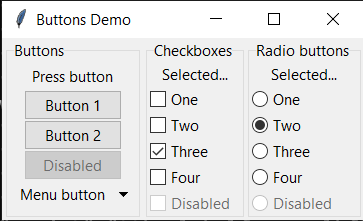

<p align="center">
    
</p>

## php-tkui

`php-tkui` allows you to build desktop ui applications with PHP only. It leverages [FFI](https://www.php.net/manual/en/book.ffi) extension and [Tcl/Tk](https://www.tcl.tk) for that, thus you don't need to compile or install any external extensions.

<p align="center"></p>

### Requirements

* PHP >= 7.4
* `ffi` extension must be enabled
* Tcl/Tk >= 8.6

### Getting started

Make sure that Tcl/Tk is installed in your OS. For Debian/Ubuntu based distros you may install it with `apt`:
```sh
sudo apt install tcl tk
```
Next, check `FFI` extension is enabled:
```sh
php --ri ffi
```

Clone this repository and try out the demos:
```sh
git clone https://github.com/skoro/php-tkui.git php-tkui
cd php-tkui
composer install
php demos/buttons.php
```

### Configuration

You may enable some application features like:
- debug mode
- appearance

Copy the provided `.env.example` into `.env` and customize the options.

Debug mode allows you to find out which commands are executed by Tcl engine. To enable
the debug mode set:
```env
DEBUG=true
DEBUG_LOG=php://stdout
```
All the debug messages will go to the console. You may specify a file name instead of console.

To change the application appearance comment out `THEME` option and set one of:
_clam_, _alt_, _default_, _classic_.  Additional themes for Windows: _winnative_, _xpnative_, _vista_.
By default, _auto_ is used, setting a theme depending on OS:
```env
THEME=auto
```

### Windows

You need to install one of [Tcl/Tk binary distributions](https://wiki.tcl-lang.org/page/Binary+Distributions) and set path to dlls
in `.env` file like this:

```
WINDOWS_LIB_TCL=c:\\tcltk\\bin\\tcl86t.dll
WINDOWS_LIB_TK=c:\\tcltk\\bin\\tk86t.dll
```
